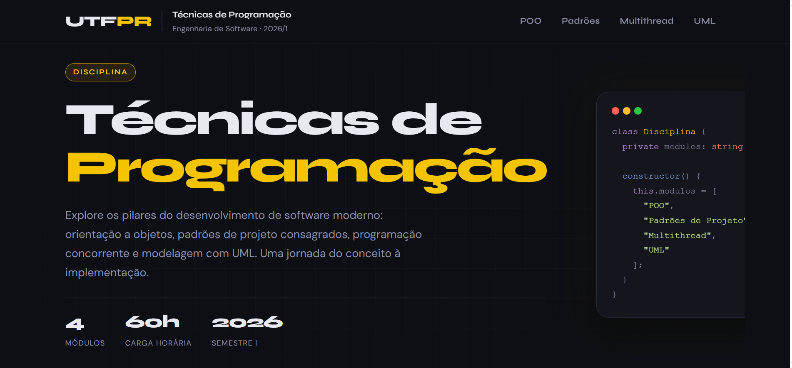

# 📚 Técnicas de Programação — UTFPR

Página web da disciplina de **Técnicas de Programação** do curso de Engenharia de Software da UTFPR (2026/1), inspirada na interface do Moodle e desenvolvida com HTML5 e CSS3 puro.

---

## 🖥️ Preview



---

## 📁 Estrutura de Arquivos

```
/
├── index.html
├── README.md
├── imagens/
│   └── paginaInicial.png
└── css/
    ├── style.css     ← Variáveis globais + @imports
    ├── header.css    ← Cabeçalho fixo e navegação
    ├── main.css      ← Hero e estrutura principal
    ├── section.css   ← Seções dos módulos
    └── footer.css    ← Rodapé
```

---

## 📖 Módulos da Disciplina

| # | Módulo | Descrição |
|---|--------|-----------|
| 01 | **POO** | Programação Orientada a Objetos — os 4 pilares fundamentais |
| 02 | **Padrões de Projeto** | Padrões GoF: criacionais, estruturais e comportamentais |
| 03 | **Multithread** | Concorrência, sincronização e programação assíncrona |
| 04 | **Documentação UML** | Modelagem com diagramas de classes, sequência e casos de uso |

---

## ✅ Requisitos Atendidos

- [x] Título, parágrafo e lista em cada seção
- [x] Cabeçalho com nome do curso e breve descrição
- [x] Layout responsivo para desktop e dispositivos móveis
- [x] Separação de responsabilidades em arquivos CSS modulares
- [x] Variáveis CSS centralizadas no `style.css`

---

## 🚀 Como Executar

Basta abrir o arquivo `index.html` diretamente no navegador — não há dependências de build ou servidor:

```bash
# Clone o repositório
git clone https://github.com/sk-3/tecnicas-de-programacao.git

# Acesse a pasta
cd tecnicas-de-programacao

# Abra no navegador
open index.html  # macOS
xdg-open index.html  # Linux
start index.html  # Windows
```

---

## 🎨 Tecnologias

- **HTML5** — estrutura semântica
- **CSS3** — variáveis, grid, flexbox, animações
- **Google Fonts** — Syne (display) + DM Sans (corpo)

---

## 📄 Licença

Desenvolvido para fins acadêmicos — UTFPR · 2026/1.
